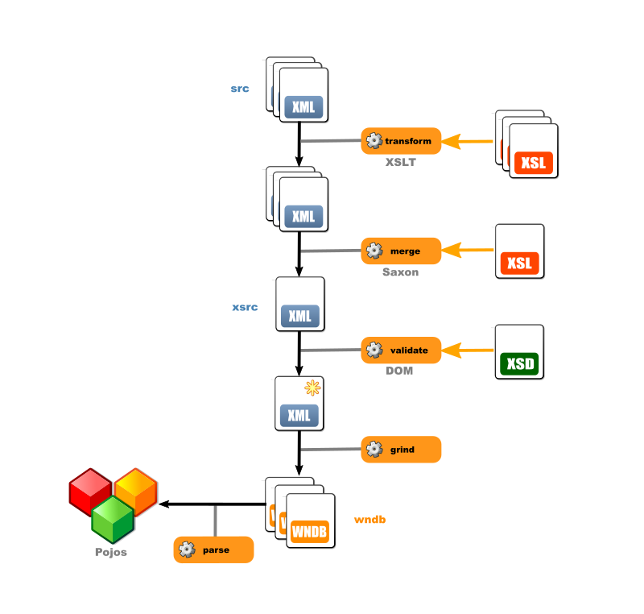

# X English WordNet

<i>X</i> stands for '<b>trans</b>formed' (as in <i>xform</i>) or 'e<b>X</b>tended', so while it may be pronounced '<i>xoon</i>', it must be undertood as <b>XSLT-transformed and Extended English WordNet.</b>

*'Shadow'* English WordNet is a  fork of upstream  [globalwordnet/english-wordnet](https://github.com/globalwordnet/english-wordnet). Please note this independent initiative is not endorsed by the Global WordNet Association. This is the direction I would suggest taking, but by no means the one they'll take. Data issues should be referred to the upstream project.

***

This project  is designed to produce a __transformed__ version of English Wordnet data in the form of

- augmented XML files in the __xsrc__ directory
- WordNet-format data in the __wndb__ directory

***

### Name space

The project is due to migrate to a namespace of its own: https://github.com/x-englishwordnet/ with

- [xewn](https://github.com/x-englishwordnet/xewn), the master project
- [schemas](https://github.com/x-englishwordnet/schemas) 
- [wndb](https://github.com/x-englishwordnet/wndb), a release version that can work as a replacement for w3.1.dict.tar.gz
- [tools](https://github.com/x-englishwordnet/tools) to group the various tools

### Build tag

In each directory a *build* file is to be found that indicates the upstream commit the data is derived from. The __src__ remains for ease of reference.

## Tools

The data is processed and generated by a number of tools:

### Transformer

[ewn-transformation](https://github.com/1313ou/ewn-transformation) 
[ewn-transformation3](https://github.com/1313ou/ewn-transformation3) 
Transformation is based on XSLT 1.0 to make processing __declarative__, __versatile__ and __pipelined__.

In some cases it is easier to declare transformations in XSLT 3.0. A Woodstox transformer is then used.

 Adds attributes to *Sense* elements
1. '*sensekey*' (internal, generated from database image)
2. '*sensenum*' (generated, index of Sense in LexicalEntry)
3. '*lexid*' (generated, lexid in WordNet's sense)
4. '*lexfile*' (generated when merging, to point to the file that provides the source data)
5. '*verbFrames*' (generated as a list of references from syntacticBehaviour elements)
6. '*verbTemplates*' (generated as a list of references to sentence templates)
7. '*adjPosition*' (generated from update file)
8. '*tagCnt*' (generated from cntlist.rev file)

Factors out SyntacticBehaviours to avoid redundancy, syntactic behaviours are referenced by an ID list attribute in Sense instead. 

Generates sents.vrb and sentidx.vrb as text files (this is how syntactic behaviours are referenced in Wordnet)

Generates a sensemap. Each line maps a sense id to its generated internal sensekey and, if any, its PWN foreign key (dc:identifier).

### Merge tool

[ewn-merging](https://github.com/1313ou/ewn-merging) 
XSLT merging of lexicographer files.
Merges the XML files into one using XSLT 3.0-conformant Saxon 9.9 powerhouse transformer

### Validator

[ewn-validation](https://github.com/1313ou/ewn-validation) 
[ewn-validation2](https://github.com/1313ou/ewn-validation2) 
Validation is based on XSD which permits fine-grained strict type validation.
5 schemas are provided to validate each stage of the pipeline (see below)
Types have been factored out.
Two versions of the schemas are available : one relaxing ID references, to be used with split lexicographer files (some references cross file boundaries, notably derivations), the other that does not (to be used with self-contained merged file) that imposes extra constraints of existence.

### WNDB grinder

[ewn-grind](https://github.com/1313ou/ewn-grind) 
This produces WNDB(5WN) format files from the merged XML file.

##  Lexid

The old specification defined lexids this way:

> One digit hexadecimal integer that, when appended onto lemma , uniquely
> identifies a sense within a lexicographer file. lex_id numbers usually
> start with 0 , and are incremented as additional senses of the word are
> added to the same file, although there is no requirement that the
> numbers be consecutive or begin with 0 . Note that a value of 0 is the
> default, and therefore is not present in lexicographer files.

This used to limit the number of senses to 16 per lexicographer file. Now the lexicographer files have changed formats and no longer use this scheme to distinguish senses. So the old lexid is left orphaned (it's a reference to something that no longer exists in the new lexicographer files).

Lexid is now defined as:
> - __0__ if the sense is unique in the lexical entry
> - __the 1-based index of the sense__ in the lexical entry in case of multiple senses in the lexical entry.

The __0 index__ refers to a unique sense in the lexical entry. One has to think of the __0 index__ as reserved and meaning '*all senses*', the way 0 means '*all synset members*' in some contexts. The present definition is compatible with this wider usage (the one sense is tantamount to '*all senses*' in this specific case).

The range is now not limited to [0-15] and can exceed it.

The implication is that the lexid field after each lemma member in the data files can exceed one hexadecimal character. This does not seem to pose a problem for most parsers which assume a space-separated numerical field rather than a one-byte length one.

##  Sensekeys

Sensekeys are __generated__ .

__Each sense has a unique sensekey__ that works as an *inner* key to the database senses.

The PWN31 sensekeys are still available in the XML files but they are not used. They are considered __foreign__ keys.

Note that a sensemap can be generated by one of the XSL scripts, that maps a generated sensekey to a unique PWN31 sensekey, if it exists. The mapping is 1-1 but *sparse* due to every sense not having a PWN31 sensekey.

If the senses are not reordered in the XML source files, the same sensekeys will be generated, so it provides some stability.

## SQL

Likewise a __sqlite__ [version](https://sourceforge.net/projects/sqlunet/files/5.3.0/sqlite/sqlite-5.3.0-2019-all.zip) is provided, derived from wndb data. __mysql__ versions available soon.

")

### SQL builder

[sqlunetbuilder](http://sqlunetbuilder.sourceforge.net/) 
SQL builder to generate *myslq* and *sqlite* versions of the data. This is based on [SQLUnet](http://sqlunet.sourceforge.net/)  (SQL Unified *Net)

## Android Semantikos application

Semantikos-ewn Android app is available in open-track beta on [Google Play](https://play.google.com/apps/testing/org.sqlunet.browser.ewn) . It's meant to make browsing easy.
It's a sister app to [Semantikos WordNet](https://play.google.com/store/apps/details?id=org.sqlunet.browser.wn&hl=en). 
