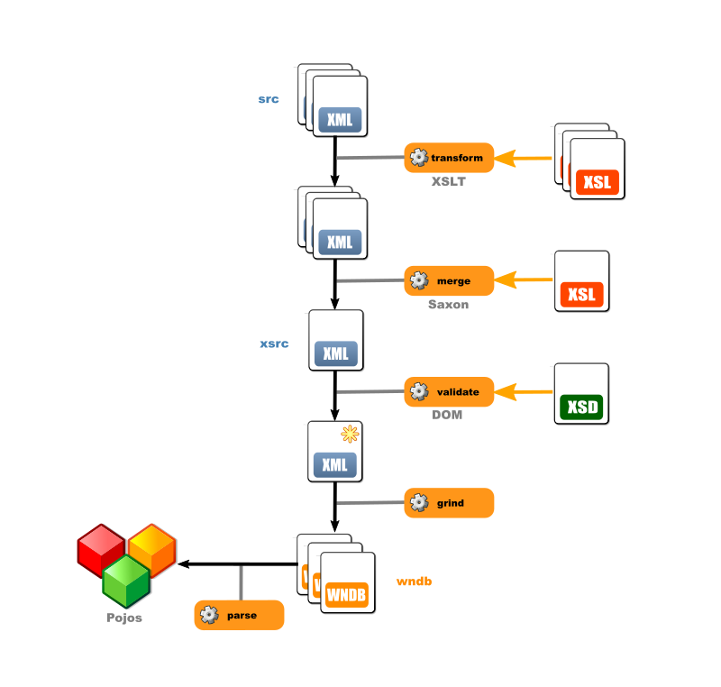

# English WordNet grinder

Refer to [x-englishwordnet](https://github.com/x-englishwordnet) and [globalwordnet/english-wordnet](https://github.com/globalwordnet/english-wordnet).

This is designed to produce English WordNet data in the **WNDB** format (in the _wndb_ directory). 

**This requires XML preprocessing** by XML [tools](https://github.com/x-englishwordnet/xml-transform-merge-validate).

See also [tools](https://github.com/x-englishwordnet/xewn/blob/master/README-tools.md).

See also [index.sense](https://github.com/x-englishwordnet/xewn/blob/master/README-index.senses.md).

See also [XML_diffs](https://github.com/x-englishwordnet/xewn/blob/master/README-XML_diff.md)

## WNDB grinder

[ewn-grind](https://github.com/1313ou/ewn-grind) 
This produces WNDB(5WN) format files from the merged XML file.

## Command line

`grind.sh [XSRCDIR] [OUTDIR]`

grinds the WNDB database

`grind1.sh [XSRCDIR] [POS] [OFS]`

partially grinds the WNDB database and output line at *offset* of *data.{noun|verb|adj|adv}*

*where*

[XSRCDIR] xsrc directory where annotated XML files are

[POS]     n|v|a|r

[OFS]     offset

##  Lexid

The old specification defined lexids this way:

> One digit hexadecimal integer that, when appended onto lemma , uniquely
> identifies a sense within a lexicographer file. lex_id numbers usually
> start with 0 , and are incremented as additional senses of the word are
> added to the same file, although there is no requirement that the
> numbers be consecutive or begin with 0 . Note that a value of 0 is the
> default, and therefore is not present in lexicographer files.

This used to limit the number of senses to 16 per lexicographer file. Now the lexicographer files have changed formats and no longer use this scheme to distinguish senses. So the old lexid is left orphaned (it's a reference to something that no longer exists in the new lexicographer files).

Lexid is now defined as:
> - __0__ if the sense is unique in the lexical entry
> - __the 1-based index of the sense__ in the lexical entry in case of multiple senses in the lexical entry.

The __0 index__ refers to a unique sense in the lexical entry. One has to think of the __0 index__ as reserved and meaning '*all senses*', the way 0 means '*all synset members*' in some contexts. The present definition is compatible with this wider usage (the one sense is tantamount to '*all senses*' in this specific case).

The range is now not limited to [0-15] and can exceed it.

The implication is that the lexid field after each lemma member in the data files can exceed one hexadecimal character. This does not seem to pose a problem for most parsers which assume a space-separated numerical field rather than a one-byte length one.

##  Sensekeys

Sensekeys are __generated__ .

__Each sense has a unique sensekey__ that works as an *inner* key to the database senses.

The PWN31 sensekeys are still available in the XML files but they are not used. They are considered __foreign__ keys.

Note that a sensemap can be generated by one of the XSL scripts, that maps a generated sensekey to a unique PWN31 sensekey, if it exists. The mapping is 1-1 but *sparse* due to every sense not having a PWN31 sensekey.

If the senses are not reordered in the XML source files, the same sensekeys will be generated, so it provides some stability.

##  Sensekeys lemma

Sensekeys support uppercase.

The ***index.sense*** is intended to be compatible and, when case is involved and makes a difference, includes two lines: the first is lower-cased and will be selected by legacy libraries, the second is cased.

The ***index.sense.cased*** file lists the possibly-cased sensekeys, one per line without redundancy.

'%%' escapes '%' in the lemma.
